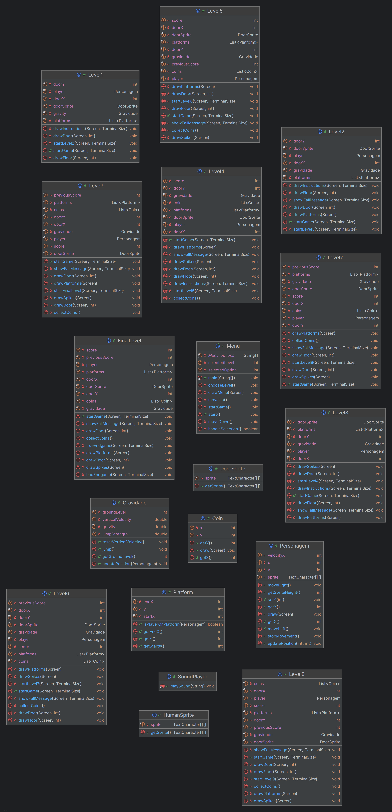

<h1 align="center">
  LDTS_L03G05 - Jumping Jack
</h1>

**Jumping Jack** is a 2D platform game where players collect coins while navigating through levels filled with spikes and holes. The main goal is to collect as many coins as possible while avoiding obstacles that could lead to a Game Over. With increasing difficulty, **Jumping Jack** offers an engaging experience, testing players' reflexes and strategy as they strive to achieve the highest score in order to unlock a suprising ending.

> Developed by **Matilde Silva** (up202305722@edu.fe.up.pt), **Sérgio Almeida** (up202305946@edu.fe.up.pt), and **Tiago Almeida** (up202303450@edu.fe.up.pt) for **LDTS 2024** at **FEUP**.
---

## **IMPLEMENTED FEATURES**

* **Main Menu**:
  * **Navigation**: the user must use the up and down arrow keys through the 3 different options: Play, Exit and Levels.
  * **Commands**:
    * **Enter**: Select an option.
    * **Escape**: Exit the game.
  * **Escape**: to stop executing the game.
  * **Options**:
    * **Play**: Start the game at level 1.
    * **Exit**: Exit the game.
    * **Levels**: Access 10 different levels.

* **Character Movement**:
  * `^`: Jump
  * `<`: Move left
  * `>`: Move right
      
* **Platforms**:
  * Green platforms were implemented to provide a safe way to reach higher areas, helping avoid dangerous obstaclesn and even uncover hidden coins along the way.

* **Spikes and Holes**:
  * The strategic placement of spikes and holes enhances the game's level design, forcing players to carefully navigate their environment and overcome these obstacles to progress.
      
* **Collision Detection**:
  * Detects when the player collides with spikes, causing the level to restart.
* **Levels**:
  * The game includes 10 levels with progressively increasing difficulty through more challenging obstacles. If the player loses in one level, the game will restart from that one level.
    
* **Coins**:
  * Collecting coins rewards the player, with a sound effect when a coin is collected.
    
* **Gravity**:
  * A realistic gravity system is implemented, causing the character to fall after jumping until they land or hit an obstacle.
---

## **DESIGN**

### **General Structure**

* **Mockups**:
  -Menu Screen Mockup
  
  

  -Levels
  
  

  -Instructions
  
  (> arrow to run in front)
  
  
  
  (^ arrow to jump for the green platform, otherwise the character will lose, by falling in the hole)
  
  

  (the player must jump over the spike, otherwise the character will loose)
  
  

  (the player must collect all the coins for a surprising end)
  
  

  (once the player loose, it shows that the character died)
  
  

  
* **Problem in Context**:
  * Designing an interactive and dynamic environment was challenging, particularly ensuring smooth character movement and responsive collision detection.
  * In this project, we aimed to incorporate pixel art mockups to enhance the game's visual appeal. However, given our limited experience in pixel art and the project's other priorities, we opted for a more basic design approach. This decision allowed us to focus on core gameplay mechanics and ensure a timely delivery. So these are features we're keen to delve deeper into for future implementations. We have decided to keep these pixel art mockups as part of our project documentation. They were instrumental in helping us visualize our desired game mechanics and aesthetics, and as such, they have become an integral part of our development process.

    -Menu Screen Mockup
    
    
    
    -Running in Front (D)
    
    
    
    -Running backwards (A)
    
    
    
    -Jump (W)
    
    
    
    -Collecting coins
    
    
    
    -The player lose if he doesn't jump over the spike
    
    

### **Design Patterns**
The use of the following patterns allowed and easy way of adding new features, and a more organized code structure, improving both maintainability and flexibility throughout the project.

* **Model-View-Controller (MVC)**:
  * **Model**: Used for game logic and data management. It encapsulates the core functionalities, including the game mechanics, level progress, and player state.
  * **View**: Manages graphical representation on the screen. The use of Lanterna helps in creating the graphical interface while ensuring the game remains text-based.
  * **Controller**: Handles event management and coordinatinates user input with the appropriate actions in the game. It serves as the intermediary between the view and the model, processing key presses.

* **Singleton**:
  * Centralized management of game state, including level, and player progress. Throughout the game, only one object controls the game's global state, which can be accessed from anywhere in the program.

* **Observer**:
  * Allows efficient event handling between the player input and the game state. By using this pattern, multiple components of the game (such as the player character, enemies, and the game world) can subscribe to and listen for changes in the game state. Only the relevant components are notified when changes occur, optimizing performance.
    
* **Command**:
  * Manages interactions between the player and the game. User input (e.g., pressing a key) is translated into a command object that encapsulates an action to be executed. 

* **Facade**:
  * Simplifies interaction with the **Lanterna** library for better code organization, providing a higher-level interface for handling graphics, input, and screen updates. 

---

## **TESTING** 

* Mutation testing was conducted to ensure code robustness. We used **Pitest** for mutation testing, which helped identify potential weaknesses in our code by introducing artificial changes (mutations) and checking if the tests could detect them. This process helped improve the reliability of our code by ensuring that it could withstand unexpected changes.

---

## **RESOURCES**

* **Tools**:
  * **Lanterna**: Used for graphical interface and gameplay rendering.
  * **Pitest**: Used for mutation testing to improve code quality.
    
---

## **UML CLASS STRUCTURES AND OVERVIEW** 

---

## **CONCLUSION**
To conclude, the development of Jumping Jack has been an interesting and valuable experience. Throughout the project, we explored various aspects of game development, from implementing core mechanics to organizing the code with design patterns. We found the process rewarding, as it allowed us to apply theoretical concepts in a practical setting.

